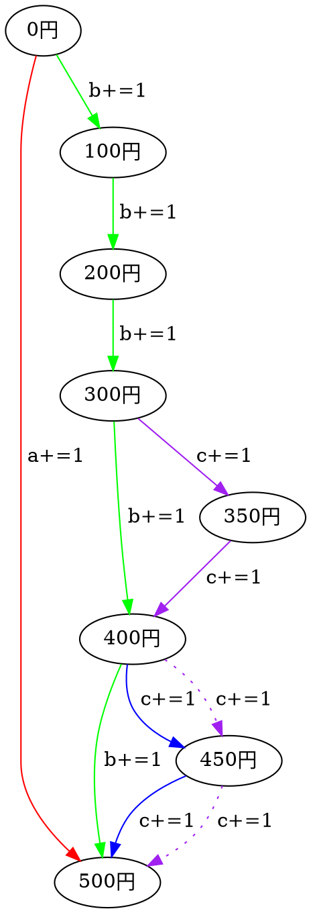

# ABC087B Coins

https://atcoder.jp/contests/abs/tasks/abc087_b

愚直な貪欲法だとTLEになってしまう（かなしい）ので考察を残す。いざやってみると全然できなくて理論的な実装が下手なのを痛感してつらい。
((もはやc#でやるべきではない感すごい...))

この問題よく考えていたら有向非巡回グラフの経路の数を数える問題っぽい。

例えば以下の問題のことを考えてみる。

>500円玉(a):= 1枚  
>100円玉(b):= 5枚  
>50円玉(c) := 4枚  
>合計金額(x):= 500円

まずは最短経路はa=1であることは自明。この後を総当たりするのがダメらしい。
なので、想定されうるパターンを最短経路順に考えてみた。(red->green->blue->purple)

本当なら0円、100円のノードからも50円玉を払うことで分岐できるが、今回求められているのが払う枚数の組み合わせであることと、枚数に制約があることから後ろ側から分岐させることにする。

なので答えは以下の表のとおりとなる。

Color | a | b | c
------|---|---|----
red|1|0|0
green|0|5|0
blue|0|4|2
purple|0|3|4

このグラフを書いていて経路を数える問題だと気がついた。きっと再帰使っていることもTLEの原因だがせっかくなのでメモした次第